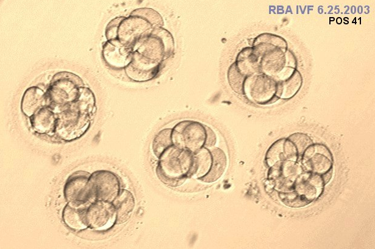

# Clinical need in IVF

The focus of my research was to improve outcomes of *in vitro* fertilization (IVF), with the end goal of improving pregnancy rates and reducing the incidence of negative outcomes such as miscarriage, pregnancy complications and preterm birth. These negative outcomes often happen for one of two reasons: 

1. __no viable embryos__ are transferred and the patient does not become pregnant or miscarries
2. __two or more viable embryos__ are transferred and the patient has twins or triplets, which have a very high risk of complications and preterm birth

To avoid these poor outcomes, physicians would ideally want to transfer **exactly one viable embryo** to their patient so that they have a singleton pregnancy. Unfortunately it is currently very difficult to figure out which embryos are viable and which are not. 

The current best available predictor of viability is a morphological assessment, where embryos are judged on their cell number, symmetry and degree of fragmentation. This is not a very precise predictor of viability, as only about 50-60% of embryos which look "good" are actually viable. A real clinical example is shown below: all of the embryos shown appear to have good morphology, but only one actually resulted in a pregnancy upon transfer.

To compensate for the difficulty in accurately choosing a viable embryo for transfer, physicians often transfer two embryos to boost the patient's chances of pregnancy. However, in a significant fraction of these cases both of the embryos are viable and the patient becomes pregnant with twins. This is also undesirable for reasons mentioned above. The table below shows a sample of the trade-offs between transferring 1 and 2 embryos at once, assuming that 60% of embryos are viable and a physician is choosing embryos for transfer at random. The ideal outcome, a singleton pregnancy, is highlighted in orange.

From the table it can be seen that transferring two embryos rather than one greatly reduces the chances that the patient will not become pregnant. Since most patients would rather have twins than not get pregnant at all, most clinics in the United States still transfer two embryos at once despite all of the risks of twin pregnancy. We would like to change this practice and encourage single embryo transfer (SET), but this requires the development of a better predictor of viability (with higher positive predictive value).

**Goal: Develop a method to predict embryo viability with higher positive predictive value compared to the current gold standard (a morphological assessment)**