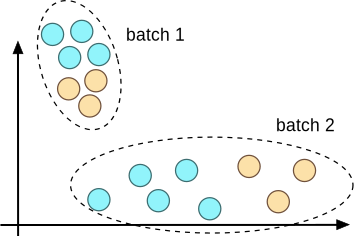
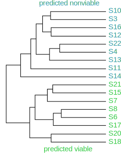

# Identifying genes important for embryo development

This project was a continuation of my [work on predicting embryo viability](../predicting-viability.html). Once I built a classifier to predict embryo development outcomes, I was able to use it to understand differences in gene expression between embryos predicted to be viable and those predicted to be nonviable. 

This study yielded insight into what can go wrong early in development to prevent an embryo from resulting in a successful pregnancy. It also resulted in me becoming very comfortable with using R and writing Unix shell scripts, since many tools for gene expression data analysis are written in R, and the data processing pipeline involves a great deal of repetition on large amounts of data (in this case nearly 500 GB!).

This material is drawn from [my recently published paper](http://www.nature.com/ncomms/2016/160224/ncomms10809/full/ncomms10809.html) and accompanying code can be found on my [GitHub profile](https://github.com/liviaz/EmbryoProject/tree/master/RNA_seq_analysis). 

### Motivation

My motivation for working on this project was to answer (or at least start to answer) a fundamental question in developmental biology: **why do some embryos develop to term while others don't?** Even in the absence of infertility, only a minority embryos which fertilize successfully are capable of completing development and resulting into a baby. Some arrest early on in development, while others develop for many weeks and ultimately result in miscarriage. 

To answer this question, an ideal approach would be to take some sort of biological measurement of embryos (such as gene expression) at the time of fertilization (day 1), and then track their outcomes, either as a binary "baby/no baby" or as a set of possible outcomes such as developmental stage reached. The molecular data from day 1 could then be correlated with the recorded outcome, and genes with the highest predictive power could be investigated further to establish a causal link between misregulation of that gene and developmental outcome.

Unfortunately, this type of study has been difficult to do because biological measurements such as gene expression are destructive to the embryo. To correlate them with developmental outcomes, we would need to accurately predict those outcomes by the time the biological measurement is taken. The only studies which have attempted this type of experiment have used maternal age or egg chromosomal number as their predictor of developmental outcomes. Although these variables _are_ predictive of future viability (for example, a chromosomally abnormal egg will never result in a healthy baby), they are far from perfect.

I thought this would be the perfect opportunity to use my noninvasive day 1 predictor of viability as a better "ground truth" than maternal age or chromosomal status. So at day 1 after fertilization, I measured embryo biomechanical properties to predict their developmental outcome, and measured their gene expression at the same time.

### Initial results

I gathered gene expression and mechanical data on 22 day 1 human embryos (sequencing is expensive!), of which 11 were predicted viable and 11 were predicted nonviable based on mechanics. This experiment was run in two batches, with 10 embryos in the first batch and 12 in the second. When I first started the data analysis, I plotted the first two principal components and hoped for a separation by viability, as shown below:

In the plot above, "bad1" and "bad2" are the embryos predicted to be nonviable, while "good1" and "good2" were predicted to be viable, where the "1" and "2" denote the experimental batch number. To my dismay, I couldn't really see any trend in this plot. The only pattern I could pick out is that within each batch, especially within batch 2, the "good" and "bad" embryos did seem somewhat separated from each other.

After speaking with many other scientists, I learned that batch effects could indeed have a huge effect on sequencing data, and that there is also a large amount of biological variation between different human individuals. An illustration of batch effects is shown below. Within each batch there is separation between the two classes but without knowing which data came from which batch, it is impossible to separate the classes.

This information led me to realize that variation in my data could come not just from batch effects across experiments, but also from genetic variation between the IVF patients who were the parents of embryos in my data set. So maybe if I corrected for "batch" effects across patients I could be left with what I was _really_ looking for: differences between viable and nonviable sibling embryos within each patient.

### Correcting for batch effects

This all sounded great, but the only problem was that I had no idea which patient each embryo came from -- the only information I had for each embryo was its gene expression data and its mechanical characteristics. 

At this point, the only possible thing I could think to do was to look at [genetic variants](http://en.wikipedia.org/wiki/Single-nucleotide_polymorphism) in the gene expression data. Embryos coming from the same parent would likely have similar variations in their sequences, and so clustering them by these variations may reveal groups of sibling embryos. This analysis yielded the following plot of the correlation coefficient between embryo genetic variants:

From this plot, it appears that 7 groups of siblings are present: {14,11,13,16}, {18,17,21}, {12,15}, {20,22}, {10,8}, {6,7}, {3,4}, and there are 5 embryos with no siblings: 2,19,5,1,9. To correct for batch effects between patients we need at least two embryos from each patient (to estimate the variation within that patient), so I ended up excluding the 5 singletons and keeping the 17 embryos with siblings. 

I used the [sva](http://bioconductor.org/packages/release/bioc/html/sva.html) package in R to correct for the "batch" effects between different patients, and then regenerated the principal component plot from earlier:

This plot looks much better, with perfect separation between the viable and nonviable embryos. This "perfect" separation is likely artificial because there were so few embryos measured for each patient; for a patient with exactly 1 good and 1 bad embryo, of course they appear perfectly separated. With more embryos per patient, this may not hold up. 

Hierarchical clustering of embryos post-adjustment for batch effects is shown below, and again shows perfect separation between the viable and nonviable groups.

Now we can actually look for statistically significant differences in gene expression between the "good" and "bad" groups. This analysis was conducted with the [edgeR](http://bioconductor.org/packages/release/bioc/html/edgeR.html) package in R, which returns adjusted p-values for all genes in the input data. 

In my data I detected expression of 12,342 total human genes, and of these 1,879 (15%) were differentially expressed (DE) between the viable and nonviable embryos with an adjusted p-value (commonly called a q-value) of q < 0.01. A scatterplot of all expressed genes is shown below, where the ratio of gene expression between viable and nonviable embryos is plotted against the total expression of that gene in counts per million. Genes with q < 0.01 are highlighted in blue. 

... to be continued

