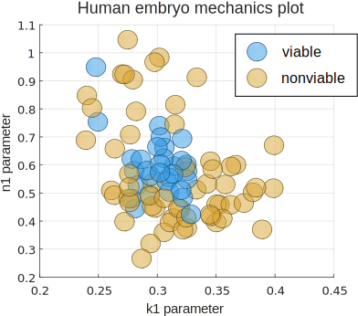
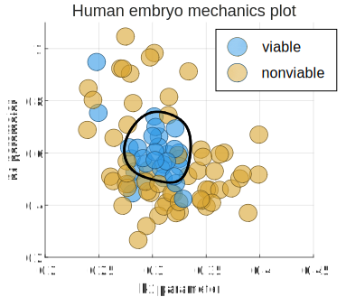
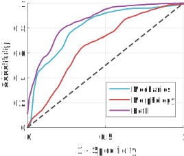

# Project: predicting embryo viability

The goal of this project was to develop a predictor of embryo viability with better performance compared to the current clinical gold standard. You can read more about the motivation behind this project and the clinical need in _in vitro_ fertilization (IVF) [here](../clinical-need.html).

On this page I will go into detail about how I gathered parameters for my model and how I validated them in a laboratory and clinical setting. This material is drawn from [my recently published paper](http://www.nature.com/ncomms/2016/160224/ncomms10809/full/ncomms10809.html) and also from my class project for CS 229 at Stanford (Machine Learning).

The code for this project was written in Matlab and can be found on my [GitHub profile](https://github.com/liviaz/EmbryoProject).

### What is currently done?

**Gold standard:** In IVF clinics today, embryos are typically chosen for transfer based on a morphological assessment. This assessment includes information about the number of cells in the embryo (embryos which develop more slowly are less viable), and some qualitative parameter(s) about the appearance of those cells (embryos which are fragmented or asymmetrical are also less viable). For a transfer at the day 5 blastocyst stage, examples of good and poor morphology are shown below.

**How well can morphology predict viability?** One [study](http://www.sciencedirect.com/science/article/pii/S0015028206044530) of over 2000 IVF cycles evaluated the ability of the day 5 morphological grade to predict clinical pregnancy. It reported an area under the ROC curve of approximately 0.66, which is better than choosing embryos for transfer at random but not really high enough to be considered a "good" predictor. 

At a sensitivity value of 68% (which is where they set their threshold), the positive predictive value was only 44%. This means that only 44% of _good morphology_ embryos transferred actually resulted in a pregnancy -- not a stellar success rate. However, only 31% of _all_ embryos transferred resulted in a pregnancy, so morphology did have some value in identifying viable embryos. 

Still, I thought we can do better, so I decided to gather other kinds of parameters to construct a better predictor of viability.

### Searching for a better predictor of viability

My criteria for choosing parameters to measure were guided by their potential for clinical application. This means I was looking for data that I could gather noninvasively and without significant disruption to the existing clinical workflow. I also wanted to focus on parameters which could be measured objectively. There is a lot of variability in human-assigned morphological scores which probably contributes to the poor predictive value of morphological assessment. In the end, I settled on two kinds of parameters which are described below.

### Biomechanical parameters

I developed and built a device to measure an embryo's biomechanical properties by applying a controlled pressure to it through a micropipette and observing its response. As seen below, embryos which appear morphologically similar can have dramatically different responses to the same applied pressure.

The data gathered for each embryo is its aspiration depth into the micropipette over time. For the two embryos in the images above, the data collected could look something like the image below, where one goes much farther into the pipette.

**Model generation:** How can we quantify these variations in response? Based on the literature in cell mechanics, a bulk viscoelastic model is generally a good choice. Cells have been shown to have both liquid-like (viscous) and solid-like (elastic) mechanical behavior, which varies based on cell type, disease state, and other factors. Elastic behavior in mechanical models is typically represented by springs, while viscous behavior is represented by dashpots as shown below.

By combining these elements in various arrangements in parallel and/or in series, one can build an infinite number of viscoelastic models which could describe cell behavior. A few models are shown below, starting with 2-element models (on the left) and including an example of a possible 5-element model (on the right).

There are many possible types of models but I only tested these 5 because they are commonly used in the literature and because deriving the solution becomes increasingly difficult (and numerical computation becomes drastically slower) as more elements are added. 

**Model selection:** So ... which of these models best describes the behavior of an embryo in response to a step pressure input? One common strategy is to fit each model to a set of recorded data and calculate the mean square error (MSE) within that data set. This has the pitfall that the most complex model will always have the lowest in-sample error and can lead to overfitting. Therefore, it is best to fit the model to a set of training data first and calculate its error on an independent set of testing data to estimate its true generalization error. This concept is illustrated in the image below which is adapted from [Wikipedia](https://en.wikipedia.org/wiki/Overfitting#/media/File:Overfitting_svg.svg).
 

For each embryo, I only had one set of data points which described its response to pressure. Because applying pressure to an embryo can change its mechanical properties, I couldn't just measure an embryo again to obtain an independent set of testing data. To compensate for this I used cross-validation within the data from a single measurement and computed an "out-of-sample" testing error by combining model predictions across testing partitions. A sample of each model's fit to data from one embryo is shown below.

Qualitatively, the 4-parameter modified SLS and the 5-parameter Wiechert models appear to fit the data well, and so we can guess that the 4-parameter modified SLS is the best model because it has the lower complexity of the two. A plot of the training (in-sample) and testing (generalization / out-of-sample) errors are shown below for all models. For each model, the testing error was averaged over data from 197 mouse embryos. 

Although it is difficult to tell from just looking, the 4-parameter model has slightly lower testing error than the 3 and 5-parameter models (p < 0.01). Therefore we can see our previous intuition is confirmed, and the 4-parameter modified SLS is the best model to describe the mechanical behavior of a 1-cell embryo. Because this is still a bulk model, it is important to note that the 4 parameters do not correspond to individual structures within the embryo, but rather describe its behavior as if it were a homogeneous material. 

### Predicting viability  

_Now that we have defined these 4 parameters and can measure them, can we use them to predict viability?_

The experimental design I used to answer this question is shown below, where ideally a measurement at day 1 after fertilization could be used to predict development to a later time point. In this case, development to the day 5-6 blastocyst stage is used as a proxy for viability, where embryos reaching this milestone are labeled "viable," and the rest are labeled "nonviable." Of course, not all embryos which develop to the day 5-6 blastocyst stage will go on to become a live birth, so this is not a perfectly reliable indicator of viability. 

I gathered two separate data sets with human embryos (one with n = 89 and one with n = 235) where I measured their mechanical properties at day 1 after fertilization and recorded development to day 5-6. The data from the first set of embryos looks like this (plotted in 2D only).

 

From the plot, it appears that viable embryos have mechanical parameters close to (k1, n1) = (0.30, 0.59), and the farther away they are from this point the less likely they are to be viable. It would be great to come up with a classifier that could predict whether an embryo is viable or not given a measured set of mechanical parameters. 

**Embryo classification:** So what kind of approaches could we use to construct such a classifier? Some possibilities include:

1. **Decision tree:** This might work reasonably well to pick out a rectangular region around the region with viable embryos
2. **Logistic regression:** This would output a linear decision boundary and would therefore require some transformation of the parameters 
3. **Support vector machines (SVM):** This would require the use of a kernel such as a radial basis function to appropriately encircle the region with viable embryos

I ended up choosing to use an SVM classifier because with appropriate tuning it can produce a decision boundary similar to the one output by the other two methods. It also doesn't require any assumptions to be made about the shape of the "viable" region -- I won't have to manually choose an appropriate transformation for the parameters. 

Now, how can we appropriately tune the SVM parameters to predict embryo viability? There is the same risk of under/over-fitting that we encountered in the section on model selection above. In SVM, this results in a decision boundary which is too smooth to capture the shape of the data, or so complex that it fits the training data perfectly but does not generalize well:

 

We can again find an appropriate balance between bias and variance by using cross-validation to select the radial basis function sigma parameter and the box constraint parameter. The decision boundary which minimizes the mis-classification rate is shown below. 

 

Although this approach works quite well to separate viable from non-viable embryos, one drawback of using SVM is that it is difficult to link a data point's distance from the decision boundary to a real-world interpretation. For example, suppose we wish to rank a group of embryos by viability and choose the _most_ viable one. We could elect to rank them by their distances from the SVM decision boundary and choose the one with the largest positive distance; however, there is no easy way to transform this distance value into a metric such as an embryo's likelihood of viability.

**Feature selection:** One thing we haven't explored yet is whether some parameters in our model are more predictive than others. Keeping useless parameters in a model can hurt its performance, so we want to make sure to only keep parameters that add predictive value to our model. 

There isn't always a best way to find the optimal combination of features for a model. Here I only tested combinations of up to 4 features, so I was able to use a brute force approach (exhaustive search, which is O(2^n)). For larger data sets (see my work on using 6-degree-of-freedom accelerometer and gyroscope data to detect head impacts [here](http://ieeexplore.ieee.org/document/6805633/?reload=true)), approaches such as forward or reverse feature selection may be necessary (and are only O(n^2)). 

For the data in this project, I used an exhaustive search and looked for a combination of features which maximized the area under the ROC curve. It turned out that only two mechanical parameters were sufficient to maximize the classifier's performance, as shown below:

 

### Comparison to morphological assessment

Comparison to morphology and ROC curves

 

Bar plot of max ROC

 

### Other morphological parameters

### Conclusions

**Time lapse imaging parameters:** I also gathered some imaging parameters to see how their performance in viability prediction compares to that of mechanical parameters. These imaging parameters can be measured using commercially available equipment found in IVF clinics, and correspond to the length of time between various cell divisions and other events in development. 

The scientific premise behind these parameters is generally that embryos which develop too slowly or too quickly are abnormal in some way and not likely to be viable. A couple of papers from [2010](http://www.nature.com/nbt/journal/v28/n10/abs/nbt.1686.html) and [2011](http://humrep.oxfordjournals.org/content/26/10/2658.short) describe some specific timing intervals which may be particularly predictive of viability.

Go into a little bit of detail on what is currently measured and how "optimal" region is determined.
Talk about what other parameters we measured and how we can improve on simple thresholding.

