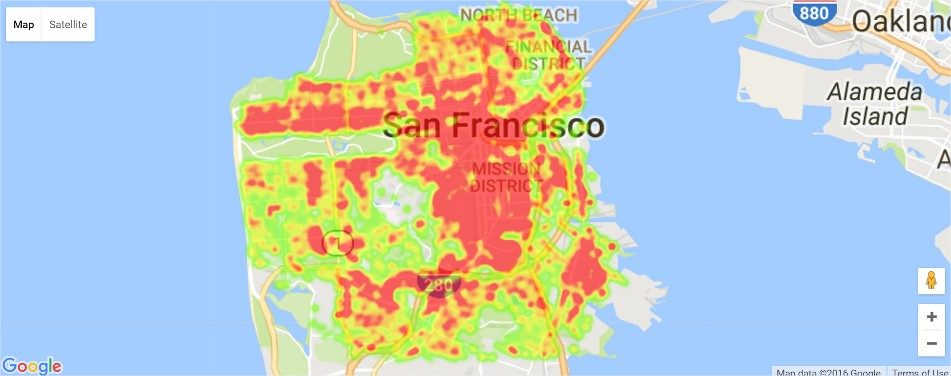
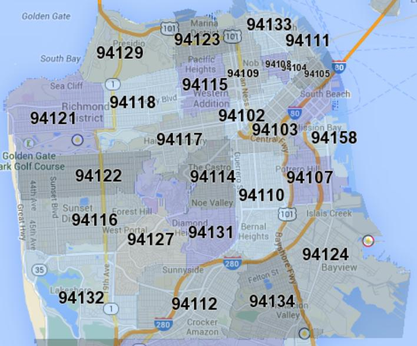
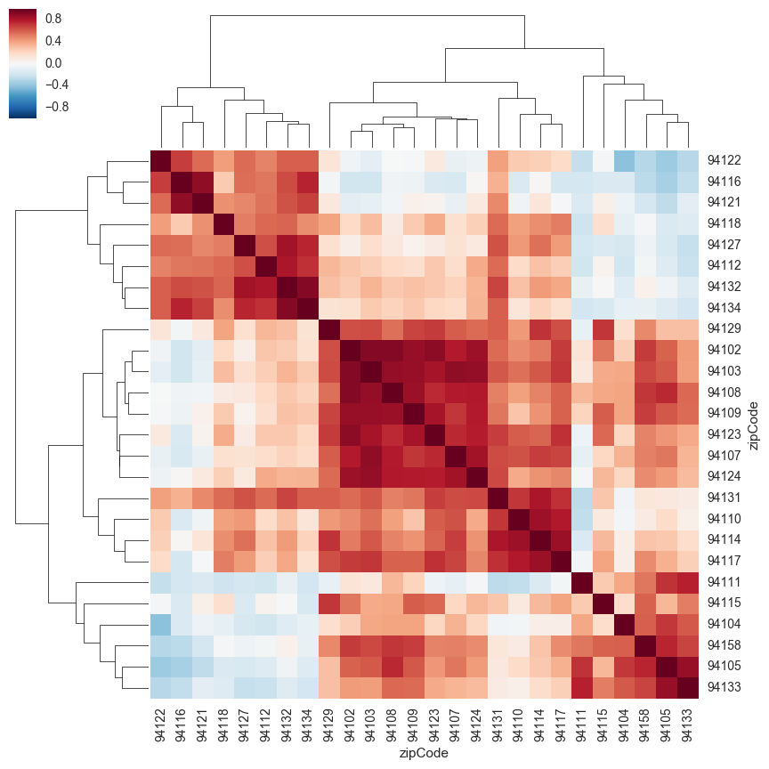
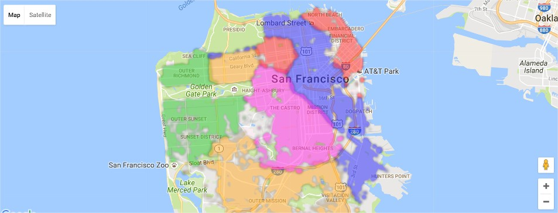
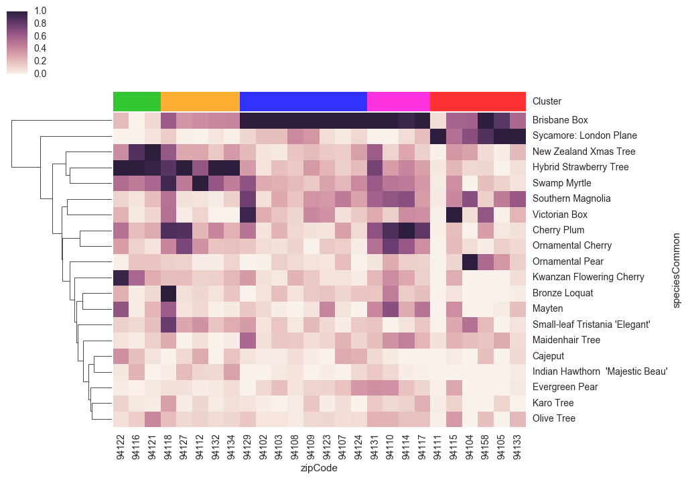

# Mapping San Francisco tree geography

This is a project I worked on in my spare time which was motivated by my interest in working with geographical data and my desire to finally get more comfortable with Python. Luckily, the city of San Francisco has an incredible assortment of [publicly available data](https://data.sfgov.org/) which anyone can download and start playing with. Since I'm a big fan of nature and green space in cities, I settled on a list of all street trees in San Francisco from the Department of Public Works. 

You can see the full iPython notebook for this project [here](http://nbviewer.jupyter.org/github/liviaz/liviaz.github.io/blob/master/files/TreeMapping.ipynb).

### A few findings

Using the [gmaps package](https://github.com/pbugnion/gmaps), I plotted the locations of the trees in my dataset:

We can query the zip code of each tree's location based on its latitude and longitude using the [uszipcode package](https://github.com/MacHu-GWU/uszipcode-project). A map of all the zip codes in SF is shown below:

We can then cluster zip codes together by how similar their tree profiles are:

When we plot these on the map, we can see that zip codes with similar tree profiles are (mostly) geographically adjacent!

What kinds of trees are typically found in these different clusters? 

