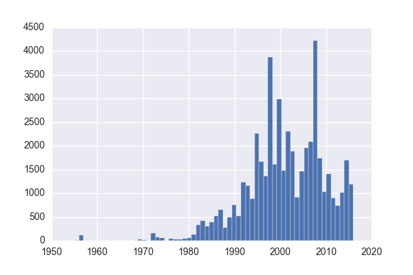

# Mapping San Francisco tree geography

This is a project I worked on in my spare time which was motivated by my interest in working with geographical data and my desire to finally get more comfortable with Python. Luckily, the city of San Francisco has an incredible assortment of [publicly available data](https://data.sfgov.org/) which anyone can download and start playing with. Since I'm a big fan of nature and green space in cities, I settled on a list of all street trees in San Francisco from the Department of Public Works. 

## Full project findings 

You can see the iPython notebook for this project [here](http://nbviewer.jupyter.org/github/liviaz/liviaz.github.io/blob/master/files/TreeMapping.ipynb).

A very brief summary is given below. I highly encourage looking at the notebook linked above for more details!

### Tree location plotting 

Using the [gmaps package](https://github.com/pbugnion/gmaps), I plotted the locations of the trees in my dataset:

Looks like they are very spread out all over the city, with a high concentration of trees in the center of the city (the Hayes Valley / West Mission / Castro areas). There are almost no trees in this database which are located in the Presidio or Golden Gate Park, which means the numerous trees in those areas must be kept track of by some other branch of the city government. 

### Grouping trees by zip code

How can we begin to explore differences in the spatial distribution? Although it would be great to separate trees by neighborhood, this information is difficult to come by (and neighborhood boundaries are not well-defined). Instead, we can query the zip code of each tree's location based on its latitude and longitude using the [uszipcode package](https://github.com/MacHu-GWU/uszipcode-project). A map of all the zip codes in SF is shown below:

Since SF is known for its microclimates, it would be interesting to see if a zip code's tree profile (i.e. which trees are most common) depends on its geographic location within the city. This would also imply that zip codes which are adjacent to each other are likely to have similar tree profiles.

### Finding zip codes with similar tree profiles

We can then compute correlations between tree counts in each zip code, and cluster them together: 

There appear to be some pretty strong correlations between some of the zip codes! Based on the qualitative appearance of the heatmap above (and its associated dendrograms), I split the zip codes into 5 clusters:
1. {94122,94116,94121}
2. {94118,94127,94112,94132,94134}
3. {94129,94102,94103,94108,94109,94123,94107,94124}
4. {94131,94110,94114,94117}
5. {94111,94115,94104,94158,94105,94133}

Where do these clusters lie in SF? When we plot these on the map, we can see that zip codes with similar tree profiles are (mostly) geographically adjacent:

### Most common trees by zip code

What kinds of trees are typically found in these different clusters? 

Upon a quick examination, it looks like areas closer to the coast (mostly in **clusters 1 and 2** which are in green and orange on the map) have high numbers of the New Zealand Xmas tree and the Hybrid Strawberry trees. According to the [Friends of the Urban Forest](http://www.fuf.net/tree/new-zealand-christmas-tree/), both of which are well adapted to coastal climates and strong winds, which makes them perfect for planting on the west side of SF.

### Trees planted over time

We've looked at how trees vary across the city, but we also have some information about when each tree was planted which we haven't explored yet. Let's first look at how many trees were planted in each year:

Looks like there was a huge increase in tree planting in the 1990s, which was sustained into the 2000s. This decade has seen slightly lower numbers so far. Let's break this down by neighborhood (keeping the coloring by cluster from before) to see if planting efforts were focused in different neighborhoods over time:

It appears that before 1990, most planting was focused in the center of the city, in particular in **94114** and **94117** which correspond to the Castro and Haight neighborhoods. After 1990, many more trees were planted in **94102** and **94104** which are the downtown areas with the highest tree densities. Most of the tree planting in general has been focused on the east side of the city which contains most of the touristy areas including downtown and the piers. 

### Model building

See iPython notebook for details.

